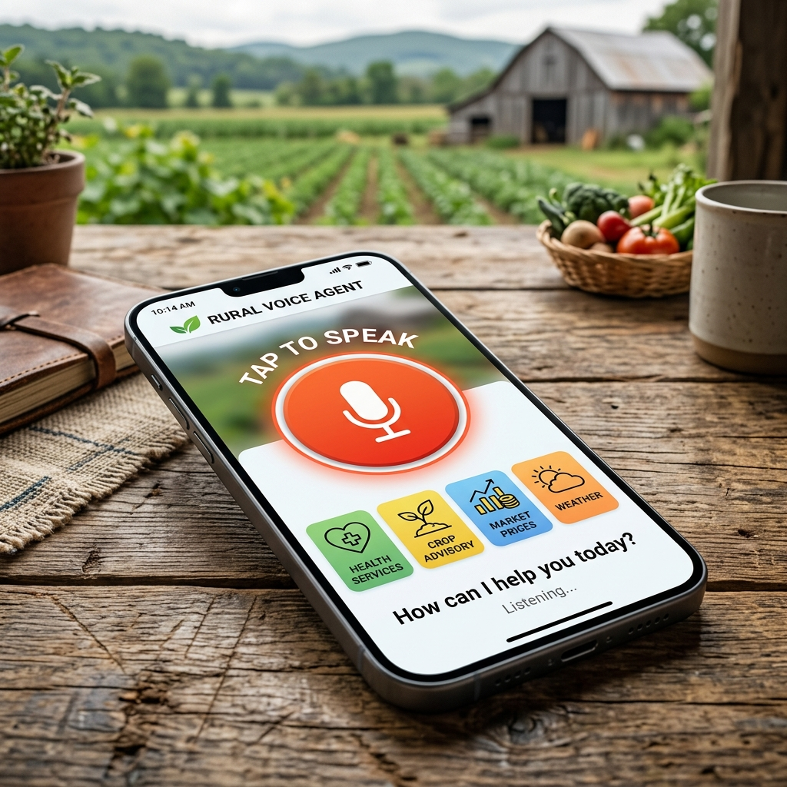
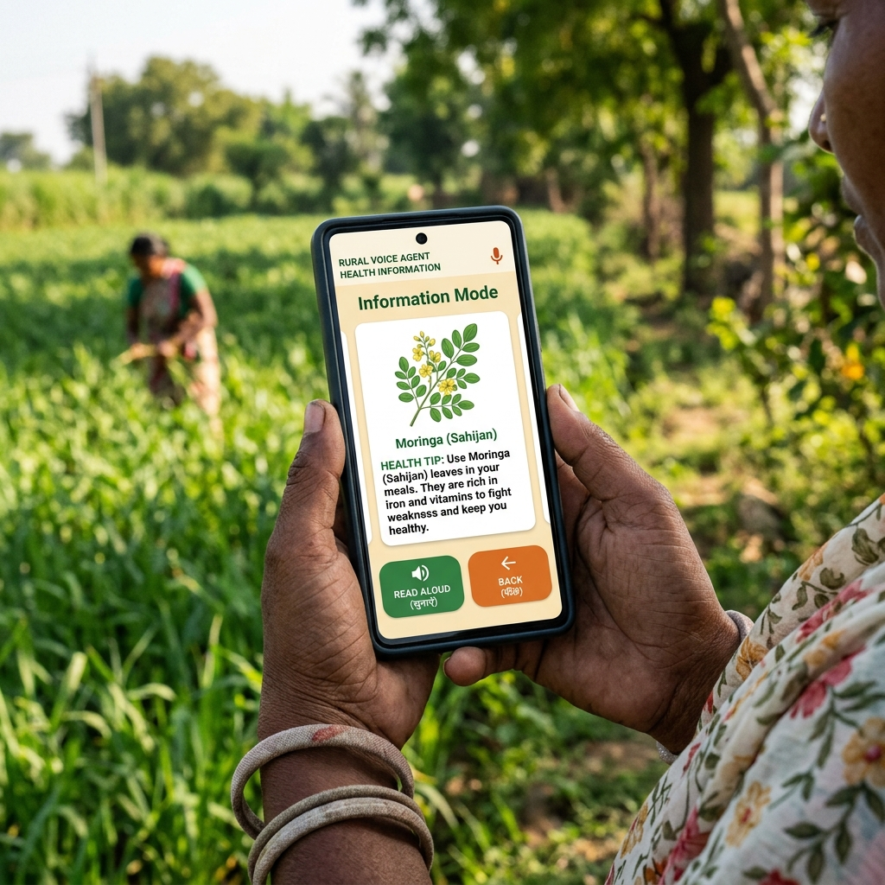
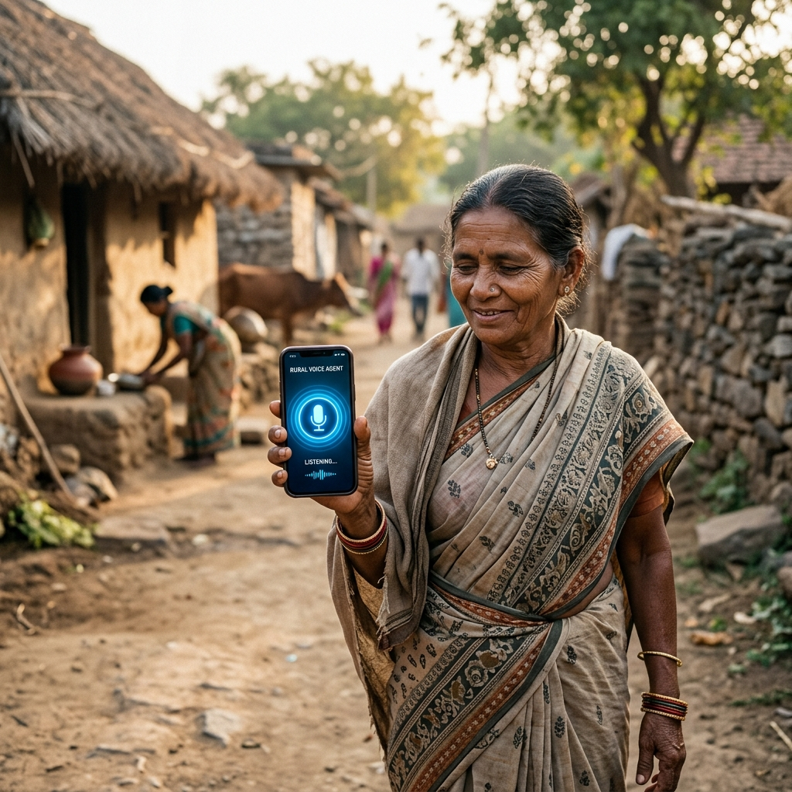
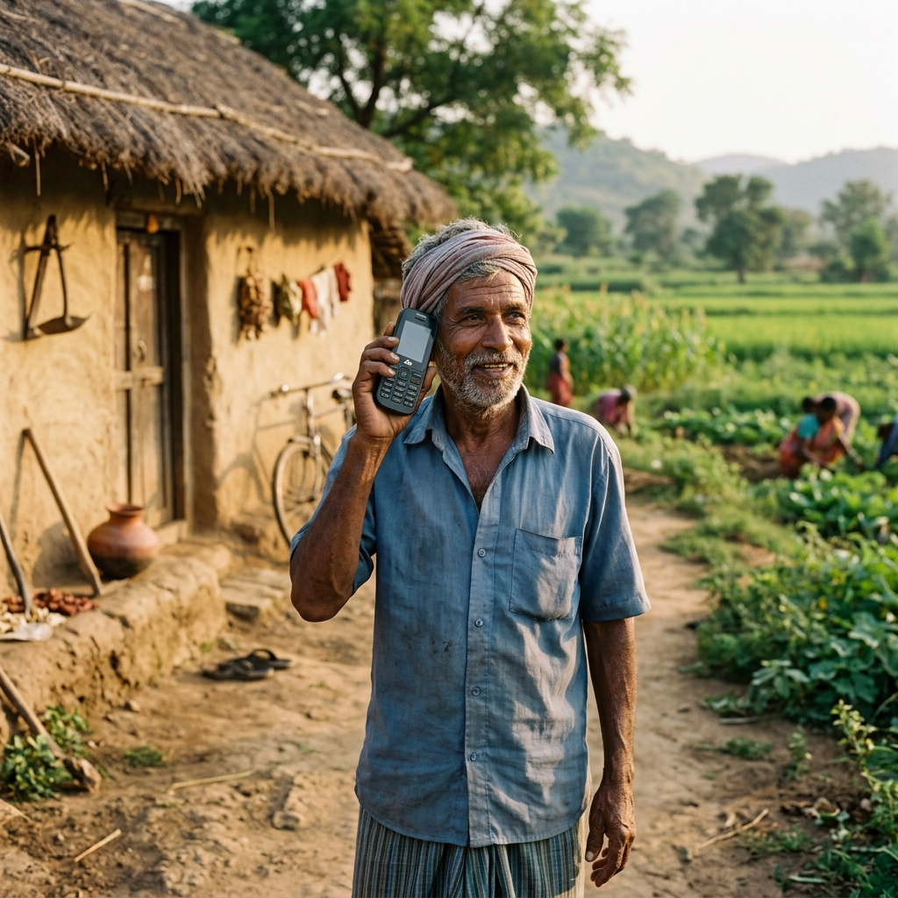

# Rural Health Agent Prototype Photographs

This folder contains the generated prototype photographs for your project, including both the **Android App** interface and the **Feature Phone Calling Agent** scenario.

## 1. Primary Interface (Home Screen)
Designed for urban/Android users, this mockup shows the main "Tap to Speak" interface with a large microphone button.

---

## 2. Information Mode (Response Screen)
Demonstrates the agent providing health information with clear visuals and audio controls.

---

## 3. Contextual Usage (Smartphone)
A realistic photograph showing the smartphone interface being used in a rural setting.

---

## 4. Calling Agent via Feature Phone (Inclusivity)
This photograph captures the **Calling Agent** scenario, where a user in a rural setting uses a **basic feature phone** to access services. This is the primary solution for users without smartphones.

